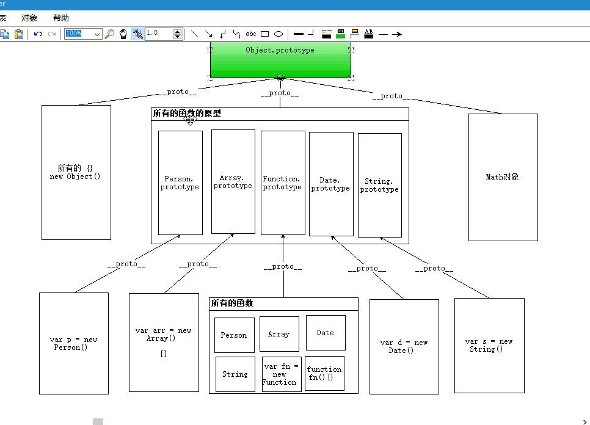
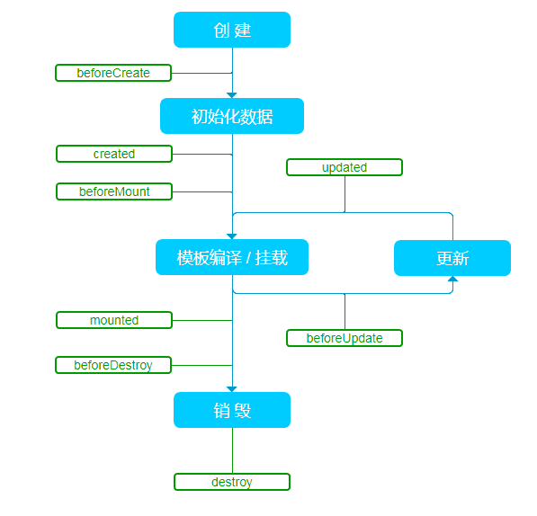

# 总结01

1. [1号面试题网站](https://github.com/h5bp/Front-end-Developer-Interview-Questions/tree/master/Translations/Chinese)
2. [2号面试题网站](https://github.com/qiu-deqing/FE-interview)

## 画一个自适应正方形
```html
  <div class="placeholder"></div> 
```
### 第一种
```css
  .placeholder { 
    width: 100%;
    height: 100vw;
  }
```
### 第二种
```css
  .placeholder { 
    width: 100%;
    height:0;
    padding-bottom: 100%;
}
```

## 画一个空心三角形
```css
.sanjiao {
  width: 100px;
  height: 100px;
  border-left: 1px solid red;
  border-top: 1px solid red;
  position: relative;
}

.sanjiao:after {
  content: "";
  position: absolute;
  left: 29px;
  top: 29px;
  width: 141.4px;
  height: 141.4px;
  border-left: 1px solid red;
  transform: rotate(45deg);
}
```

## geolocation怎么用的
```js
  // 获取当前定位
  navigator.geolocation.getCurrentPosition(function(position) {
    do_something(position.coords.latitude, position.coords.longitude);
  })
```

## cookie,localstorage,sessionStorage
特性          | Cookie | localStorage | sessionStorage
------------ | ------------- | ------------ |-----------
数据的生命期 | 一般由服务器生成，可设置失效时间。如果在浏览器端生成Cookie，默认是关闭浏览器后失效  | 除非被清除，否则永久保存 | 仅在当前会话下有效，关闭页面或浏览器后被清除
存放数据大小 | 4K左右  | 一般为5MB |
与服务器端通信|  每次都会携带在HTTP头中，如果使用cookie保存过多数据会带来性能问题 | 仅在客户端（即浏览器）中保存，不参与和服务器的通信
易用性 | 	需要程序员自己封装，源生的Cookie接口不友好 | 源生接口可以接受，亦可再次封装来对Object和Array有更好的支持

## 原型链


## 继承的几种方式
1. 原型链继承
2. 借用构造函数
3. 组合继承
4. 原型式继承
5. 寄生式继承
6. 寄生组合式继承
7. [点击进入网址查看源码](https://www.jianshu.com/p/4cfccbc06052)

## 数组去重的几种方式
```js
  //方法一：
  var arr = [5, 2, 2, 4, 3, 3, 2, 4, 1];
  for(var i = 0; i < arr.length; i++){ // 遍历数组中的每一项

      for(var j = i+1; j < arr.length; j++){ //   相邻的两个数进行比较，

        if(arr[i] == arr[j]){         
        arr.splice(j,1); // 判断如果有重复的值； 用数组splice方法删除 后面的那个相同的数；

              j--; //注意这里的 j--， 因为删掉一个数后，数组的长度也会减少1；
          }
      } // 这个方法类似于前面讲到的冒泡，规律差不多的；
  }
  alert(arr);

  //方法二：
  var arr = [1, 2, 3, 4, 1, 2, 3, 2, 1, 4, 3, 2, 3, 4, 1, 2];
    
  //1 声明一个结果数组
  var resultArr = [arr[0]],     // 申明一个新数组，用来存不重复的值；
    flag;
  
  //2 遍历arr，取出arr中的每个元素，到resultArr中进行依次比較
  for (var i = 1; i < arr.length; i++) {
    flag = true; //假设当前这个arr[i]可以放入到resultArr中
    
    //3 遍历resultArr：验证
    for (var j = 0; j < resultArr.length; j++) {
      //需要保证任意一个都不等，才可以放入
      if (arr[i] == resultArr[j]) {
        flag = false; 
        //提高效率
        break;
      }
    }
      
    if (flag == true) {
      resultArr[resultArr.length] = arr[i];
    }
      
  }
  console.log(resultArr);


  //方法三： //  与第二方式差不多，只不过这个方法是用循环完了里值会等于数组的长度的特性来判断的；
  var arr = [5, 0, 0, 4, 0, 3, 2, 0, 1];
  var newArr = [arr[0]];       //申明一个新数组；

  for(var i = 1;  i < arr.length; i++){

    for(var j = 0; j < newArr.length; j++){

      if(arr[i] == arr[j]){
          break; // 如果老数组中有任意一个个与新数组中的元素相等，则跳出循环；j就不会等于newArr.length了；
      } 
    } 


    if(j == newArr.length){ // 这里如果判断 j 如果等于newArr.length; 说明没有进入上面的那个if判断，说明没有重复的值，
      newArr[newArr.length] = arr[i]; // 利用length属性，讲不重复的值放入新新数组中；
    }
  }


// alert(newArr);
```

## url中获取其中的参数
```js
  // 获取地址参数对象
  function getSearch() {
    var txt = location.search.slice(1).split('&');
    var obj = {};
    txt.forEach(function (e, i) {
      var key = e.split('=')[0];
      var value = e.split('=')[1];
      obj[key] = value
    })
    return obj
  }
```
1. [网站资料](https://www.jianshu.com/p/3a449542a4d6)

## 单页应用的前进和后退问题

### 对于一个应用而言，url 的改变(不包括 hash 值得改变)只能由下面三种情况引起：
1. 点击浏览器的前进或后退按钮
2. 点击 a 标签
3. 在 JS 代码中触发 `history.push(replace)State` 函数
> 只要对上述三种情况进行拦截，就可以变相监听到 history 的改变而做出调整。针对情况 1，HTML5 规范中有相应的 onpopstate 事件，通过它可以监听到前进或者后退按钮的点击，值得注意的是，调用 `history.push(replace)State` 并不会触发 onpopstate 事件。


## 移动端兼容性问题
- [移动端常见的一些兼容性问题](https://blog.csdn.net/hardgirls/article/details/51722519)

## vue组件间的通讯
### 1.父组件向子组件通信
- 方法一：props 
  > 使用props，父组件可以使用props向子组件传递数据。

### 2.子组件向父组件通信

- 方法一:使用vue事件
  > 父组件向子组件传递事件方法，子组件通过$emit触发事件，回调给父组件。
  
### 3.非父子组件、兄弟组件之间的数据传递

> $on方法用来监听一个事件。
> $emit用来触发一个事件。

## vue脚手架搭建和配置
### 脚手架的使用:
> 1 全局安装脚手架: npm i -g vue-cli
//  注意: 全局安装一次即可

> 2 在目录中运行命令: vue init webpack 项目名称
//  注意: 目录不要带有中文路径, 目录名称也不要是:  vue / vue-cli

[详情](https://blog.csdn.net/jiang7701037/article/details/79490784)


## 背景图片cover,container,还有设置背景图片原点问题
### cover:
> 缩放背景图片以完全覆盖背景区，可能背景图片部分看不见
### contain:
> 缩放背景图片以完全装入背景区，可能背景区部分空白。
### background-origin:
```css
  background-origin: border-box
  background-origin: padding-box
  background-origin: content-box
  background-origin: inherit

  /* border-box
  背景图片的摆放以border区域为参考
  padding-box
  背景图片的摆放以padding区域为参考
  content-box
  背景图片的摆放以content区域为参考 */
```


## 两边固定,中间自适应布局
```html
  <header id="top" class="mmp_header clearfix">
    <a href="javascript: history.go(-1)" class="fl">
      <span class="iconfont icon-fanhui"></span>
    </a>
    <div class="fr">
      
    </div>
    <h3>title</h3>
  </header>
```
```less
  .mmp_header {
    padding: 0;
    line-height: 1.333333rem /* 100/75 */;
    background-color: #f4483e;
    text-align: center;
      .fl {
      color: #fff;
      width: 1.333333rem /* 100/75 */;
      height: 1.333333rem /* 100/75 */;
      span {
        font-size: .493333rem /* 37/75 */;
      }
    }
    .fr {
      width: 1.333333rem /* 100/75 */;
      height: 1.333333rem /* 100/75 */;
      img {
        display: inline-block;
        vertical-align: middle;
      }
    }
    h3 {
      overflow: hidden;
      font-size: .533333rem /* 40/75 */;
      padding: 0;
      height: 1.333333rem /* 100/75 */;
      color: #fff;
    }
  }
```

## rem和flex布局
### rem
- rem布局：解决 宽度自适应，高度自适应。
  > 通过媒体查询不同屏幕改变不同html下的`font-size`大小

  > 如何确定font-size的大小?
    设置图上量出来了一个盒子的大小，怎么转换成rem单位
  > 屏幕的fontsize/屏幕的大小 = 基准值/设计图的大小
- 用flexible 
  > 先把设计图分成10份  如果750的设计图：基准值75px  如果是640的设计图：64px

## async await
```js
  const p = new Promise((resolve, reject) => {
    setTimeout(() => {
      resolve('time out sucess')
    }, 3000)
  })

  async function getData () {
    // axios.get('http://localhost:3000/brands') 方法的返回值就是一个 Promise 对象
    // 这句代码的作用：
    // 等待 axios.get() 这个Promise的结果
    // const res = await axios.get('http://localhost:3000/brands')
    const res = await p
    // 这句代码中能够获取到 axios.get() 这个异步操作的结果，说明
    // 当这句代码执行的时候，axios.get() 异步操作已经执行完毕
    console.log('代码执行了', res)
  }

  // 4 async 和 await
  // 异步编程的终极解决方案
```

## ajax改造成同步的几种方式
```js
  // 两种方式：

  // 1、每个ajax请求中添加属性async:false;

  // 2、全局设置ajax属性

  $.ajaxSetup({

  async:false

  })
```

## v-model的几种用法

- 用在输入控件上的基本用法
```html
  <input v-model="message" placeholder="编辑我……">
```

- 用在复选框上的基本用法
```html
  <input type="checkbox" id="checkbox" v-model="checked">
```

- 用在单选框上的用法
> 由于单选框只会有一个控件处于勾选状态，所以只需要传入一个字符串即可，这个字符串需要跟控件的value一致。如果传空串，则默认不勾选任何控件

- 用在select上的用法
> select在百分之九十九的情况下是单选模式，所以传入空串或者一个字符串即可，跟单选框类似。

- 修饰符
> `.lazy`
因为在默认情况下， v-model 利用的是 input 事件来同步输入框的值与数据，如果你希望得到的是控件失去焦点的时候才触发动作（失去焦点之前不想触发动作），那你其实想要的是change事件，这时候，你可以添加一个修饰符 lazy，这样Vue不再监听input事件，改为监听change事件，这在某些场合有用

> `.number`
如果想自动将用户的输入值转为 Number 类型（如果原值的转换结果为 NaN 则返回原值），可以添加一个修饰符 number 给 v-model 来处理输入值。这用于前端过滤用户输入。

> `.trim`
过滤用户输入的前后无用字符，空格

- [详情](https://www.jianshu.com/p/86fddce5a1b3)

- v-model用于表单数据的双向绑定，其实它就是一个语法糖，这个背后就做了两个操作： 
```html
  <!-- 在自定义组件中  -->
  <my-component v-model="inputValue"></my-component>
  <!--  相当于  -->
  <my-component v-bind:value="inputValue" v-on:input="inputValue = argument[0]"></my-component>
  <!-- 这个时候，inputValue接受的值就是input事件的回调函数的第一个参数，所以在自定义组件中，要实现数据   		绑定，还需要$emit去触发input的事件。 -->
```
```js
  this.$emit('input', value)
```

## vue自定义指令
```js
  // 注册一个全局自定义指令 `v-focus`
  Vue.directive('focus', {
  // 当被绑定的元素插入到 DOM 中时……
  inserted: function (el) {
    // 聚焦元素
    el.focus()
  }
})
```

## canvas使用

  > Canvas是由HTML代码配合高度和宽度属性而定义出的可绘制区域。JavaScript代码可以访问该区域，类似于其他通用的二维API，通过一套完整的绘图函数来动态生成图形。[详细](https://blog.csdn.net/u012468376/article/details/73350998)


## 图片压缩
[HTML5 file API加canvas实现图片前端JS压缩并上传](https://www.zhangxinxu.com/wordpress/2017/07/html5-canvas-image-compress-upload/)

## 浏览器优化
### 影响性能的因素
- 白屏
  + HTML 和 CSS 的加载及解析速度
  + <head> 内的脚本加载及执行
- 首屏
  + 图片加载
  + <body> 内的脚本加载及执行
- render tree 的构建
  + HTML 的复杂度
  + CSS 的复杂度
- render tree 的绘制（栅格化）
  + 颜色的复杂度
  + 形状的复杂度
### 怎么提高前端性能？
- 提高以下几个方面，总体性能就会得到大幅度提升：

  + 缩短白屏时间；
  + 加快首屏显示；
  + 尽快监听主要操作的事件。
### 优化关键呈现路径
- 为了在首次渲染时尽可能快，我们需要优化以下三个变量：
  + 最小化关键资源数
  + 最小化关键字节数
  + 最小化关键路径长度
- 常规步骤:

  + 分析并描述关键路径：资源数、字节数和长度；
  + 减少关键资源的数量：删掉、延迟下载或标记为异步等等；
  + 优化剩余关键资源的加载顺序：尽早下载所有关键资源以缩短  + 关键路径长度；
  + 优化关键字节数以减少下载时间（往返次数）。
### PageSpeed 规则和建议
- 排除阻止呈现的 JavaScript 和 CSS
- 优化 JavaScript 的用法
  + 推荐使用异步 JavaScript 资源
  + Avoid synchronous server calls
  + 延迟解析 JavaScript
  + 避免运行时间长的 JavaScript
- 优化 CSS 的用法
  + 将 CSS 放到文档头部
  + 避免使用 CSS import
  + 内联阻止呈现的 CSS


## 浏览器缓存
- [浏览器缓存机制介绍](https://juejin.im/post/59c602276fb9a00a3d135f2e)
- [浏览器缓存机制剖析](http://louiszhai.github.io/2017/04/07/http-cache/)

## 懒加载原理
> 我们先设置图片的data-set属性（当然也可以是其他任意的，只要不会发送http请求就行了，作用就是为了存取值）值为其图片路径，由于不是src，所以不会发送http请求。 然后我们计算出页面scrollTop的高度和浏览器的高度之和， 如果图片举例页面顶端的坐标Y（相对于整个页面，而不是浏览器窗口）小于前两者之和，就说明图片就要显示出来了（合适的时机，当然也可以是其他情况），这时候我们再将 data-set 属性替换为 src 属性即可。[详解](https://www.cnblogs.com/zhuzhenwei918/p/6943156.html)
---

## 购物车流程


## 购物的优惠券怎么设计的


## 第三方支付调试
### 正常流程：
1. 正常使用支付宝、微信、银行卡（目前使用最多的第三方支付方式）支付（正常金额的支付），功能是否正常。
### 异常流程：
1. 支付账号和密码错误，系统如何处理；
2. 余额不足，系统如何处理；
3. 取消支付，系统如何处理；
4. 重复支付，系统如何处理；
5. 微信或支付宝账号未登录时支付，系统如何处理；
6. 手机上没有支付宝APP时选择支付宝支付，系统如何处理；
7. 支付期间突然断网，系统如何处理；
8. 取消支付后再次支付，系统如何处理；
9. 金额上：最小值金额的支付，最大值金额的支付，错误金额的支付（如金额格式的错误、不允许使用的货币等等）；

## 冒泡排序
```js
  //控制需要排几趟
  for (var i = 0; i < arr.length - 1; i++) {
    var flag = 1;
    //控制每一趟需要排几次
    for (var j = 0; j < arr.length - 1 - i; j++) {
      if (arr[j] > arr[j + 1]) {
        flag = 2;
        var temp = arr[j];
        arr[j] = arr[j + 1];
        arr[j + 1] = temp;
      }
    }
    //如果是1：说明没有交换，，，如果是2，说明交换
    if(flag == 1) {
      break;
    }
  }
```

## 快速排序
### 快速排序"的思想很简单，整个排序过程只需要三步：
1. 在数据集之中，选择一个元素作为"基准"（pivot）。
2. 所有小于"基准"的元素，都移到"基准"的左边；所有大于"基准"的元素，都移到"基准"的右边。
3. 对"基准"左边和右边的两个子集，不断重复第一步和第二步，直到所有子集只剩下一个元素为止。
```js
  var times = 0;
    var quickSort = function (arr) {
      //如果数组长度小于等于1无需判断直接返回即可
      if (arr.length <= 1) {
        return arr;
      }
      var midIndex = Math.floor(arr.length / 2); //取基准点
      var midIndexVal = arr.splice(midIndex, 1); //取基准点的值,splice(index,1)函数可以返回数组中被删除的那个数arr[index+1]
      var left = []; //存放比基准点小的数组
      var right = []; //存放比基准点大的数组
      //遍历数组，进行判断分配
      for (var i = 0; i < arr.length; i++) {
        if (arr[i] < midIndexVal) {
          left.push(arr[i]); //比基准点小的放在左边数组
        } else {
          right.push(arr[i]); //比基准点大的放在右边数组
        }
        console.log("第" + (++times) + "次排序后：" + arr);
      }
      //递归执行以上操作,对左右两个数组进行操作，直到数组长度为<=1；
      return quickSort(left).concat(midIndexVal, quickSort(right));
    }
```

## 二分法
```js
  // 二分法查找
  var arr = [1,3,4,6,45,76,88,450]

  // 思路：找到数组的中间数（midVal）,和你要查找的数（findVal）进行比较，
  // 如果 midVal > findVal在数组的左边，就把该数组二分（就只在左边查找）
  function binarySearch(arr, finalVal, leftIndex, rightIndex) {
    if (leftIndex > rightIndex) {
      console.log("下标错误/找不到")
      return;
    }
    // 找到中间这个只值
    var midIndex = Math.floor((leftIndex + rightIndex)/2);
    var midVal = arr[midIndex]

    //  arguments.callee属性，该属性是一个指针，指向拥有这个 arguments 对象的函数
    if (finalVal > midVal) {
      arguments.callee(arr, finalVal, midIndex + 1, rightIndex);
    } else if (finalVal < midVal) {
      arguments.callee(arr, finalVal, leftIndex, midIndex -1);
    } else {
      console.log("找到了")
    }
  }
  binarySearch(arr, 34,0,arr.length - 1)
```

## 二叉树
[JavaScript实现二叉树查找](https://blog.csdn.net/weixin_36185028/article/details/53967888)

## sass内置函数
[sass内置函数](https://github.com/jsfans/Notes/blob/master/SASS/SASS%E7%9A%84%E5%86%85%E7%BD%AE%E5%87%BD%E6%95%B0.md)

## js小数计算
[JavaScript 浮点数陷阱及解法](https://github.com/camsong/blog/issues/9)

## 技术选型
[计数选型](https://juejin.im/entry/5aa92cc06fb9a028c368805a)

## vue框架原理
[深入理解 Vue 框架](https://juejin.im/entry/5982e16a6fb9a03c50227ef5)

## 怎么写一个双向数据绑定
> 通过遍历data里面的属性，将每个属性通过object.defineProperty()设置getter和setter，将data里面的每个属性都复制到与data同级的对象里。

## zepto穿透问题
### 使用 fastclick

> 使用了 fastclick 之后,所有点击事件就可以都用 click 事件了,因为已经解决了 click 事件原本的 300ms 延迟问题.而对于 fastclick 的原理, 就是取消 touchend 延迟 300ms 后的 click 事件, 基本是通过 event.preventDefault()与某些浏览器的兼容(比如需要取消 mousemove 的默认行为, 因为它有时会比 touchstart 还快而且触发 click), 然后在 touchend 事件发生之后, 获取了点击元素, 并且马上触发了 click 事件,这样响应速度上来了,也不会点击穿透,需要注意的是用了 fastclick 之后就使用 click 处理点击吧, 因为响应速度已经上来了,并且 tap 有点击穿透的现象(因为 tap 事件的 setTimeout 原因).

```js
// 解决方法如下：
// 1、使用github上有一个叫做fastclick的库；

// 2、监听touchend事件，并在事件中使用preventDefault()阻止冒泡；

  $(".js-egg-close").on("touchend", function(e){  //这里使用touchstart事件也是可以的，
    e.preventDefault();
     $('.sec_dlg_eggs').remove();
     $(".eggs_bg").remove();
  });


  // 3、使用css3的pointer-events=true,pointer-events=none切换来实现；

  // 4.延迟一定的时间来处理事件。本人测试是超过320毫秒就不会出现穿透，与jquery的动画(fadeIn()，fadeOut())等配合，个人感觉良好;

  $(id).fadeIn(300);
  // 5.如果还不奏效，终极解决方案是用click提代tap;


  // 设置点击事件为_tap

  _tap = touchend in document ? "touchend":"click"

  // 这样在执行的过程中就可以直接调用
  div.on(_tap, function(){}) 
```

## 设计一个排名,在排名数据有可能变化的情况下怎么处理下拉加载后面的数据


## 在数据有可能变化的情况下怎么设计分页


## for循环里面嵌套异步函数的问题,执行顺序
- 遇到异步操作会丢给浏览器，执行完循环后，再执行异步操作

## 小组任务分配,管理问题


## 项目管理软件问题


## 项目流程问题


## git和svn的问题


## jquery查找父节点,子节点,兄弟节点
```js
  $("#test1").parent() // 父节点
  $("#test1").parents() // 全部父节点
  $("#test1").parents(".mui-content")
  $("#test").children() // 全部子节点
  $("#test").children("#test1")
  $("#test").contents() // 返回#test里面的所有内容，包括节点和文本
  $("#test").contents("#test1")
  $("#test1").prev()  // 上一个兄弟节点
  $("#test1").prevAll() // 之前所有兄弟节点
  $("#test1").next() // 下一个兄弟节点
  $("#test1").nextAll() // 之后所有兄弟节点
  $("#test1").siblings() // 所有兄弟节点
  $("#test1").siblings("#test2")
  $("#test").find("#test1")

  // 以下方法都返回一个新的jQuery对象，他们包含筛选到的元素
  $("ul li").eq(1) // 选取ul li中匹配的索引顺序为1的元素(也就是第2个li元素)
  $("ul li").first() // 选取ul li中匹配的第一个元素
  $("ul li").last() // 选取ul li中匹配的最后一个元素
  $("ul li").slice(1, 4) // 选取第2 ~ 4个元素
  $("ul li").filter(":even") // 选取ul li中所有奇数顺序的元素
```

## 怎么开启硬件加速

[怎么开启硬件加速](https://www.jianshu.com/p/9596c82086d5)

## 看什么书
1. 《CSS权威指南》第三版

2. 《CSS那些事儿》

3. 《精通CSS：高级Web标准解决方案》第二版

4. 《CSS禅意花园》

5. 《JavaScriptDOM编程艺术》

6. 《JavaScript权威指南》第6版

7. 《JavaScript高级程序设计》第三版

8. 《高性能JavaScript》

9. 《JavaScript王者归来》

10. 《JavaScript模式》

11. 《JavaScript设计模式》

12. 第三阶段——jQUery的学习

13. 《高性能网站建设指南》

14. 《Web开发敏捷之道》第二版
15. [web前端学习资源分享](https://juejin.im/post/5a0c1956f265da430a501f51)

## 平时怎么学习
### 学习能力(这是这个问题最根本的体现)
1. 入门阶段反复阅读经典书籍的中文版，书籍中的每一个例子都动手实现并在浏览器中查看效果
2. 在具备一定基础之后可以上网搜各种教程、demo，了解各种功能的实际用法和常见功能的实现方法
3. 阅读HTML，CSS，Javascript标准全面完善知识点
4. 阅读前端牛人的博客、文章提升对知识的理解
5. 善用搜索引擎

### 总结能力
1. 写思维导图
2. 整理md

### 思考问题的角度
1. ···

### 动手能力(这个也是面试官最想知道的，毕竟学以致用)
1. 会写一些些小dome

## 关注的什么社区
- [v2ex](https://www.v2ex.com/)
- [segmentfault](https://segmentfault.com/)
- [稀土区](https://xituqu.com/)
- [掘金](https://juejin.im/?utm_source=gold_browser_extension)
- [优设](https://www.uisdc.com/)

## 闭包的问题
```js
  // 1.es6的关键字  let
  for(let i = 0; i < btns.length; i++) {
    btns[i].onclick = function () {
      console.log(i);
    }
  }
  // 2.
  for(var i = 0; i < btns.length; i++) {
    btns[i].onclick = (function (i) {
      return function () {
        console.log(i);
      };
    })(i);
  }

  //3. 使用一个函数（自执行函数）把i的值存起来
  for (var i = 1; i <= 10; i++) {
    // setTimeout((function (i) {
    //   return function () {
    //     console.log(i);
    //   }
    // })(i), i * 1000);
    (function (i) {
      setTimeout(function () {
        console.log(i);
      }, i * 1000);
    })(i);
  }
```

## 写出你能想到的所有选择器
- 基本选择器
  + id
  + 类
  + 标签
  + 通配符*
- 关系选择器
  + 子代
  + 后代
  + 兄弟 ~
  + 相邻 +
- 属性选择器
  + [attr]
  + [attr = 'val']
  + [attr ^= 'val']
  + [attr $= 'val']
  + [attr *= 'val']
- 伪类选择器
  + child
  + of-type
  + 其他
    + :focus
    + :empty
    + :not
    + :checked
    + :disabled
- 伪元素选择器
  + `::before  ::after`
  + `::first-letter`
  + `::first-line`
  + `::selection`
  + `::placeholder`

## 封装组件的思路
1. 确定要做的事
2. 确定函数名，参数
3. 确定返回值
4. 调用测试

## 设计一个他要求的组件(不固定封装的啥,我问的是封装一个打印的组件)


## vue路由问题


## vue切换class
`:class="{ 'class-a' : isA, 'class-b': !isA}" @click="toogle"`
```js
  data: function () {
    return {
      isA: true
    }
  },
  methods: {
    toggle: function(){
        this.isA = !this.isA
    }
  }
```

## vue怎么操作dom
  - 使用`ref="box"`

## vue slot什么情况下会用到
  - 封装组件需要插入内容的时候可以用slot

## 记录当前页面位置,下次刷新还是这个位置
```js
  // 这个方法是一个通用的方法，不需要每个页面都写一次，这是利用页面的cookie完成的，把记录的滚动条的位置放入cookie，下次进入这个页面的时候读取cookie，并设置滚动条位置为cookie中的值，从而让滚动条回到上一次的位置，返回上一浏览的位置，如果多个页面是用这个功能，那就要定义多个cookie来记录不同页面的滚动高度，为了解决这一问题使用了一个相对简单的方法，就是cookie的值是以页面的文件名命名，js中创建cookie时，自动获取网页路径，截取页面的文件名，并将cookie名设置为文件名，就这样可以避免多次命名，从而减少了代码。

  $(fnction () {
    var str=window.location.href;
    str =str.substring(str,lastIndexOf("/")+1);
    if ($.cookie(str)) {
      $("html,body").animate({scrollTop:$.cookie(str)},1000);
    } else {      
    }
  })
  $(window).scroll(function () {
    var str = window.location.href;
    str = str.substring(str.lastIndexOf("/") + 1);
    var top = $(document).scrollTop();
    $.cookie(str, top, { path: '/' });
    return $.cookie(str);
  })
```

## RESTful API问题
1. PI 命名应该采用约定俗成的方式，保持简洁明了；
2. 考虑到系统迭代和兼容性需求，API 中应该引入版本规则；
3. 优雅的设计条件过滤，排序，搜索等传入参数形式；
4. 合理设计返回数据的形式，格式和考虑启用压缩（gzip）；
5. 根据不同的 API 操作，设置合适的 HTTP 状态码和必要的出错信息；
6. 使用 token 机制设计鉴权和验证系统(Authorization and Authentication[1])
7. 如何实现数据的分页返回；
8. 如何处理有关联资源的返回数据；
9. 考虑启用 HTTP 缓存机制；
10. 限制 API 调用频次（Rate limiting）；
11. 尽可能的使用 HTTPS，涉及用户验证的 API 一定要强制启用 HTTPS。


## ESlint问题
- 代码规范

## vue用的什么版本,用了多久
- 2.x 用1年

## vue和其他框架比较
[比较](https://blog.csdn.net/kingice1014/article/details/71600283)
[和react比较](http://caibaojian.com/vue-vs-react.html)

## 说说你在前端比较擅长的领域
h5 c3 js jquery ajax 移动端 vue

## html5新标签
- header、nav、footer、aside、article、section
- 有兼容性问题
- html5shiv.js
- 配合条件注册 cc:ie6

## html5和css3的新特性
- HTML5提供了新的元素来创建更好的页面结构
- HTML5 <canvas> 元素用于图形的绘制，通过脚本 (通常是JavaScript)来完成.
- HTML5 Geolocation API 用于获得用户的地理位置
- HTML5 规定了在网页上嵌入音频元素的标准，即使用 <audio> 元素
- HTML5 拥有多个新的表单输入类型。这些新特性提供了更好的输入控制和验证。
- HTML5 的 <form> 和 <input>标签添加了几个新属性.
- HTML5提供了新的语义元素来明确一个Web页面的不同部分

- 用CSS3，你可以创建圆角边框，添加阴影框，并作为边界的形象而不使用设计程序
- CSS3中包含几个新的背景属性，提供更大背景元素控制。
- CSS3 定义了两种类型的渐变（gradients）
- CSS3 字体
- CSS3 转换和变形
- CSS3 3D转换属性
- CSS3 过渡属性
- CSS3 动画，要创建CSS3动画，你需要了解@keyframes规则。@keyframes规则是创建动画
- CSS3 盒模型
- CSS3伸缩布局盒模型(弹性盒) flexbox
- CSS3 多媒体查询

## h5新增的网络协议


## 页面加载时候的渲染流程
1. 根据HTML渲染DOM树

2. 根据CSS生成CSSOM
 
3. 将DOM和CSSOM整合成Render Tree

4. 根据Render Tree开始渲染和展示

5. 遇到`<script>`时，会执行并阻塞渲染 

## 重绘和重排
1. 部分渲染树（或者整个渲染树）需要重新分析并且节点尺寸需要重新计算。这被称为重排。注意这里至少会有一次重排-初始化页面布局。

2. 由于节点的几何属性发生改变或者由于样式发生改变，例如改变元素背景色时，屏幕上的部分内容需要更新。这样的更新被称为重绘。

## 页面闪屏可能是什么原因,怎么解决


## 什么情况下开启页面硬件加速?怎么开启
[CSS3开启硬件加速](https://www.jianshu.com/p/9596c82086d5)
[Web 性能优化](https://lz5z.com/Web%E6%80%A7%E8%83%BD%E4%BC%98%E5%8C%96-CSS3%E7%A1%AC%E4%BB%B6%E5%8A%A0%E9%80%9F/)

## 如何绘制圆形和三角形
[cancas绘制圆和三角形](https://www.cnblogs.com/jarson-7426/p/6231767.html)

## 不固定高度的盒子如何实现居中(至少说出3中),其中用定位解决的时候会对其他元素产生什么影响
1. 定位法
2. flex
3. line-height
```css
  .box-inner{
    position: absolute;
    margin: auto;
    top: 0;
    bottom: 0;
    left: 0;
    right: 0;
    width: 100px;
    height: 100px;
    background: blue;
    color: #ffffff;
  }
```

## 盒子模型
> CSS盒模型本质上是一个盒子，封装周围的HTML元素，它包括：边距，边框，填充，和实际内容。

## 获取到对象的宽度包括盒子模型的哪几部分

- 当box-sizing: content-box；或不设置的时候。盒子模型总宽为 = width + 边框距(padding) + 边界(border)
- box-sizing: border-box。盒子模型总宽为 = width
> 内容(content)、边框距(padding)、边界(border)和边距(margin)。

## position的几种定位
- static 静态定位
默认来说，如果你在一个标签中没有设置css标签的position属性，默认值是static，这时候的left，right，top，z-index这些属性就会被忽略

- absolute 绝对定位
生成绝对定位的元素，脱离文档流，当设置这个属性时，我们可以设置该盒相对于其父元素的偏移量。并且，由于脱离常规流，绝对定位不会影响其兄弟元素的布局。。由此，在设置css的时候，当一个元素被其兄弟元素挡到的时候，我们可以猜测是不是各个兄弟元素都设置了绝对定位。另外，绝对定位的外边距不会跟其他盒合并，这跟BFC生成有关。

- fixed固定定位
跟absolute一样，盒的外边距不会跟其他外边距合并。相对于视口固定

- relative 相对定位
这个我之前一直跟absolute搞混。position设置为relative之后，盒的位置是根据常规流来计算的。是相对于原本的自身的偏移量。参照物是原本的自己。而absolute的参照物是他的包含块即他的父级元素。当盒B为相对定位时，后面盒的位置仍按照B没有偏移来计算的，因此也有可能会有重叠的情况出现

- inherit 继承定位
emmmm，就是继承父元素的定位方式，但是，一般来说会比较少用，也不推荐使用，因为无法预知父元素的改变，可能会造成较大的变动，同时，也不方便于项目代码的可阅读性。

## js数组去重(4中方法),es6有什么方法可以实现数组去重
- 遍历去重,建立新数组，利用indexOf判断是否存在于新数组中，不存在则push到新数组，最后返回新数组
- 遍历数组,利用object对象的key值保存数组值(key不重复)，判断数组值是否已经保存在object中，未保存则push到新数组并用object[arrayItem]=true的方式记录保存.
- 先排序，新数组最后一项为旧数组第一项，每次插入判断新数组最后一项是否与插入项相等
- es6 `...new Set(arr)`
- [详情](https://www.jianshu.com/p/131ca13e7f28)

## es6常用语法
- ES6常用语法
  + 数组扩展运算符
  + 属性名表达式
  + 解构
  + promise
  + 对象中函数的简写新型
  + 箭头函数
  + 默认参数
  + 模板字符串
  + 块级作用域`let`, `const`
  + 导入导出 `export`, `import fn form "./a"`

## promise的用法和底层实现

- promise的原理和基本使用
```javascript
// ES6 中的 Promise 是 JS 中异步编程的一个解决方案
// 在没有 Promise 之前，JS 中是通过 回调函数 来实现 异步编程的
// 实际上，Promise仅仅是提供了一种编写代码的方式，内部还是通过 回调函数 来实现的异步编程
// Promise 解决了 回调地狱 的问题

// Promise 的基本使用：

// 1 Promise 是一个构造函数
// 2 可以把 Promise 看作是一个容器，这个容器内部封装了异步操作

// 3 Promise的参数是一个回调函数
// 4 回调函数有两个参数
//  resolve 表示异步操作成功
//  reject 表示异步操作失败
//  也就是说：如果异步操作成功，应该调用 resolve；如果异步操作失败，应该调用 reject

const p = new Promise(function (resolve, reject) {
// 异步操作
setTimeout(() => {
  const num = Math.random()
  // 随机生成一个小于 0.5 的随机数
  if (num < 0.5) {
    resolve(num)
  } else {
    reject(num)
  }
}, 500)
})

// 使用Promise创建的对象
p
// then() 方法用来获取异步操作成功的结果
 .then(function (res) {
  console.log('成功了', res)
})
// catch 方法用来获取异步操作失败的结果
 .catch(function (err) {
  console.log('失败了', err)
})
```

## vue的路由用法
```js
  // 对于单页应用，官方提供了vue-router进行路由跳转的处理
  // 0. 如果使用模块化机制编程，导入Vue和VueRouter，要调用 Vue.use(VueRouter)

  // 1. 定义 (路由) 组件。
  // 可以从其他文件 import 进来
  const Foo = { template: '<div>foo</div>' }
  const Bar = { template: '<div>bar</div>' }

  // 2. 定义路由
  // 每个路由应该映射一个组件。 其中"component" 可以是
  // 通过 Vue.extend() 创建的组件构造器，
  // 或者，只是一个组件配置对象。
  // 我们晚点再讨论嵌套路由。
  const routes = [
    { path: '/foo', component: Foo },
    { path: '/bar', component: Bar }
  ]

  // 3. 创建 router 实例，然后传 `routes` 配置
  // 你还可以传别的配置参数, 不过先这么简单着吧。
  const router = new VueRouter({
    routes // (缩写) 相当于 routes: routes
  })

  // 4. 创建和挂载根实例。
  // 记得要通过 router 配置参数注入路由，
  // 从而让整个应用都有路由功能
  const app = new Vue({
    router
  }).$mount('#app')

  //route后退按钮事件
  methods: {
    goBack () {
      window.history.length > 1
        ? this.$router.go(-1)
        : this.$router.push('/')
    }
  }
```

## vue的生命周期和常用的钩子函数
- 通俗来说 vue的生命周期就是vue实例从创建到销毁的过程
- 

钩子函数  | 	描述
------------| ------------
beforeCreate |	组件实例刚被创建，组件属性计算之前，如data属性等
created |	组件实例创建完成，属性已绑定，但DOM还未生成，$el属性还不存在
beforeMount |	模板编译 / 挂载之前
mounted |	模板编译 / 挂载之后
beforeUpdate | 组件更新之前
update | 组件更新之后
activated	| 组件被激活时调用
deactivated	| 组件被移除时调用
beforeDestory	| 组件销毁前调用
destoryed	| 组件销毁后调用
> [理解vue实例的生命周期和钩子函数](https://www.jianshu.com/p/98517bd49179)

## vue的计算属性,什么情况下要用计算属性

- 当某个属性需要依赖于其他属性计算而得到时使用计算属性

## vue组件之间怎么通信传值
- 父子`[props]`
- 子父`@on='fn'`, `this.$emit('fn', params)`
- 兄弟`bus.$on('fn', params)`, `bus.$emit('fn', params)`
- vuex

## 你自己封装过组件吗?封装的是什么组件?怎么封装的,描述下大概的步骤
- 封装过计数组件
  + 首先，使用Vue.extend()创建一个组件

  + 然后，使用Vue.component()方法注册组件

  + 接着，如果子组件需要数据，可以在props中接受定义

  + 最后，子组件修改好数据之后，想把数据传递给父组件，可以使用emit()方法


## vue的缓存怎么使用
- keep-alive 是 Vue 内置的一个组件，可以使被包含的组件保留状态，或避免重新渲染。

```html
   <keep-alive include="a">
    <component>
      <!-- name 为 a 的组件将被缓存！ -->
    </component>
  </keep-alive>可以保留它的状态或避免重新渲染
  <keep-alive exclude="a">
    <component>
      <!-- 除了 name 为 a 的组件都将被缓存！ -->
    </component>
  </keep-alive>可以保留它的状态或避免重新渲染
```
```js
  // 组件 a
  export default {
    name: 'a',
    data () {
      return {}
    }
  }
```

## vue的缓存丢失后怎么办?(没听明白这个问题...)


## 打包工具用的什么?会自己配置吗?(不管会不会都说会就行了)
- webpack(会)


## vuex的用法?你在项目是怎么使用的?为什么要用vuex?
- 安装
- 实例化store
- 配置到vue实例中
- 使用 state，mutations，getters，action


